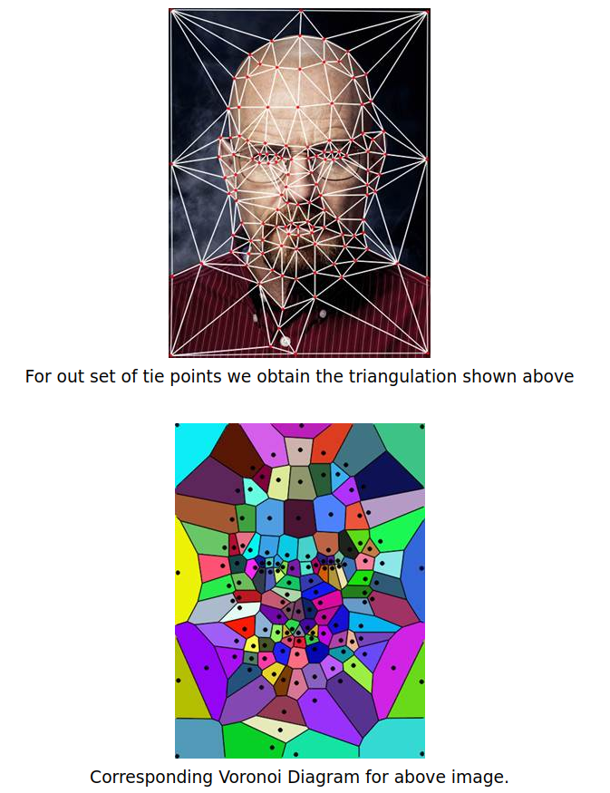

This project will present **how to morphing using Delaunay Triangulation**

---
# Definition
We can use various algorithms to generate the intermediary images while morphing an image say M to another image say N. The parameter α controls the morphing of M to N. The value of α lies between 0 and 1 (inclusive).

α = 0: the original image M (no morphing), 

α = 1: complete transformation of M to N.

It is assumed that both the images M and N are of the same dimensions.

`I(x, y) = (1 - α)*M(x, y) + α*N(x, y)`

Where as

I: Intermediate image

M: Original image

N: Target image

---

# Methodology
There are **3 steps** that are described below:

- Step 1: **Marking point**

    In this step, we mark the primary features of both image M and N, establishing a one – to – one correspondence between the points marked in M and N. For example, we morph 2 human faces, so we need to find **68 points** in each face using **dlib** libary (see this [link](https://www.pyimagesearch.com/2017/04/03/facial-landmarks-dlib-opencv-python/)
- Step 2: **Deluanay Triangulation**

    After obtaining all the marked points in both images, this program will calculate a weighted mean of the points in the two sets, based on the value of α.SM = {m1, m2, m3, ….., mk} and SN = {n1, n2, n3, ….., nk}

    We obtain another set of point `SI = {i1, i2, i3, ….., ik}, where: ik = (1 - α)*mk + α*nk`

    These are the points for the intermediate image, corresponding to the primary features of the images.

    All the three sets of points, namely SM, SI, SN, are stored in three separate text files, separated by newlines. Each text file contains same number of lines (same number of points in SM, SI, and SN), to indicate the one – to – one correspondence.  

    The next step is to apply the Delaunay Triangulation to the set SI.

    **Applying Delaunay Triangulation**

    Consider *the set of points SI* as obtained by the above steps. Triangulation operation divides the plane of the image into many small triangles, using the points of the set SI as vertices.

    Delaunay Triangulation is one such operation. The triangles chosen by this algorithm are such that no point of the set SI lies inside the circumcircle of any triangle. The advantage of such a property is that it will reject very thin triangles with one very large obtuse angle and two very small angles. Such thin triangles when morphed will not be very perceptible. 

    The triangulation is performed for all the sets SM, SI, SN, giving a one – to – one correspondence between triangles in the image M, I and N.

    There are many algorithms and libraries to calculate the Delaunay Triangulation, given a set of points. We will be using an inbuilt function named Subdiv2D, of OpenCV, which does the triangulation and returns the set of co-ordinates of the triangles thus obtained. This function generates a new text file for each image, containing the indexes of the points used as vertices in the original text files. This is analogous to a Hash Map of the marked points.

    

    
    

    - Step 3: **Affine Tranformation**

        Now, this algorithm selects a triangle T from the image M, its corresponding triangle V in the intermediate image I, and calculate the affine transform (described below) that converts the triangle T to V. It use the inbuilt function getAffineTransform, in OpenCV, to obtain the transformation matrix. Similarly, it calculates the transformation matrix of the corresponding triangle W in the image N to the triangle V. Now the transformations are applied so obtained to all the triangles of both the images M and N, to obtain warped images M’ and N’. Next, let's calculate the intermediate image I by using the same equation as the naïve algorithm:
        
        `I (x, y) = (1 - α) * M’ (x, y) + α * N’ (x, y)`

        A series of intermediate images based on different values of α are obtained. The ranging of α is between 0 and 1.

        **Affine Transformation between two triangles**, refer [link](https://www.maa.org/sites/default/files/pdf/pubs/books/meg/meg_ch12.pdf)

        ---
        # Implimentation
        The sections below briefly describe the implementation.
        
        Firstly, you need to install *scipy* library which contains **Delaunay** function and *dlib* library for human face.
        
        Secondly, download `shape_predictor_68_face_landmarks.dat.bz2`
                
                wget http://dlib.net/files/shape_predictor_68_face_landmarks.dat.bz2
                bzip2 -d shape_predictor_68_face_landmarks.dat.bz2

         **Some main functions:**
         
         `extract_features()`: extract 68 points in human face
         
         `apply_affine_transform()`: calculation affine transformation matrix between 2 triangles.

         `morphing_triangle()` and `get_morphing()`: finding sub-sequence images btw src_img and des_img

         **Run:**
         
            python3 face_morph.py -i1 {src_image} -i2 {dest_image} -o {output.mp4}
         **Demo**
         
         

        ---
        # Reference
        - https://devendrapratapyadav.github.io/FaceMorphing
        ---
        # Discussion
        - Morphing based on **Delaunay Triangulation** is simply implemented, and effectively with morphing 2 human faces. However, it is worse performance in other cases because it is difficult to find the important points to make triangles.
        - Recently, morphing is improved by using some neural networks, especially **generative adversarial networks (GAN)**.

